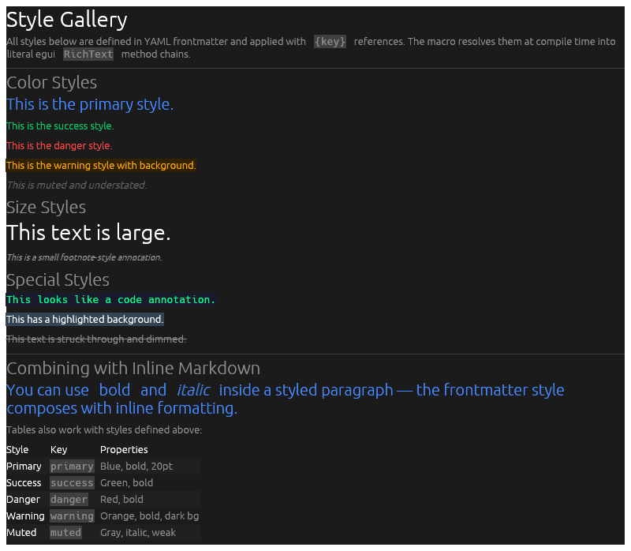
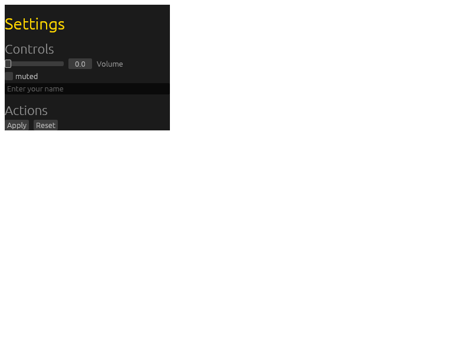
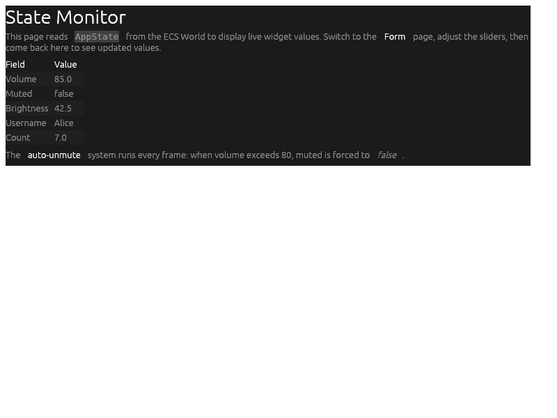
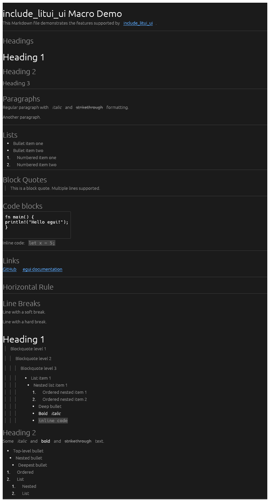

# litui

**Literate UI for [egui](https://github.com/emilk/egui).** Write your UI in Markdown files with YAML frontmatter, and have it compiled into native egui widgets at build time. Zero runtime parsing. Fully type-checked Rust.

litui turns `.md` files into egui rendering code via proc-macros, with support for styled text, CSS-like class selectors, interactive form widgets, 3rd-party widget crates, and shared state via bevy_ecs.

## What it looks like

**Styled text from YAML frontmatter** — define named presets, apply with `::key`:

```markdown
styles:
  primary: { bold: true, color: "#4488FF", size: 20.0 }
  success: { bold: true, color: "#00CC66" }
  danger:  { bold: true, color: "#FF4444" }
  warning: { bold: true, color: "#FFAA00", background: "#332200" }

This is the primary style. ::primary
This is the success style. ::success
This is the danger style. ::danger
```



**Interactive widgets embedded in markdown** — sliders, checkboxes, text inputs, all stateful:

```markdown
## Audio ::section
[slider](volume){vol}
[checkbox](muted)

## User Info ::section
[textedit](username){name_input}
[dragvalue](count){speed}

## Actions ::section
[button.success](Submit){on_submit}
[button.danger](Reset){on_reset}
```



**Cross-page state monitoring** — `[display]` reads shared `AppState` fields set by other pages:

```markdown
| Field | Value |
|-------|-------|
| Volume | [display](volume){vol_fmt} |
| Muted | [display](muted) |
| Username | [display](username) |
| Submit clicks | [display](on_submit_count) |
```



**Full markdown rendering** — headings, lists, blockquotes, code, tables, links, images:

```markdown
# Heading 1
## Heading 2
- Bullet item
  - Nested bullet
1. Numbered item
> Blockquote with depth bars
[GitHub](https://github.com/) — clickable links
```



## Quick Start

**Static content:**
```rust,ignore
use litui_macro::include_litui_ui;
use litui_helpers::*;

let render = include_litui_ui!("content.md");
render(ui); // renders inside any egui::Ui
```

**Interactive forms** (macro generates the state struct):
```rust,ignore
let (render, mut state) = include_litui_ui!("form.md");
render(ui, &mut state);
println!("Volume: {}", state.volume);
```

**Multi-page apps** with shared styles and navigation:
```rust,ignore
use litui_macro::define_litui_app;
use litui_helpers::*;

define_litui_app! {
    parent: "content/_app.md",    // shared styles
    "content/about.md",
    "content/form.md",
    "content/monitor.md",
}
// Generates: Page enum, AppState, render functions, LituiApp struct
```

## Tutorials

Step-by-step guides are built into the docs. Run `cargo doc -p litui --open` and navigate to the [`_tutorial`] module, or click the links below:

| # | Tutorial | Example |
|---|----------|---------|
| 01 | [Hello Markdown](_tutorial::_01_hello_markdown) | `tut_01_hello` |
| 02 | [Frontmatter Styles](_tutorial::_02_frontmatter_styles) | `tut_02_styles` |
| 03 | [Tables](_tutorial::_03_tables) | `tut_03_tables` |
| 04 | [Images](_tutorial::_04_images) | `tut_04_images` |
| 05 | [Styled Containers](_tutorial::_05_styled_containers) | `tut_05_containers` |
| 06 | [Widgets](_tutorial::_06_widgets) | `tut_06_widgets` |
| 07 | [Layout and Spacing](_tutorial::_07_layout) | `tut_07_layout` |
| 08 | [Multi-Page Apps](_tutorial::_08_multi_page_apps) | `tut_08_multi_page` |
| 09 | [Dynamic Content](_tutorial::_09_dynamic_content) | `tut_09_dynamic` |
| 10 | [Advanced Widgets](_tutorial::_10_advanced_widgets) | `tut_10_advanced` |
| 11 | [Bevy Integration](_tutorial::_11_bevy_integration) | `tut_11_bevy` |
| 12 | [Game UI](_tutorial::_12_game_ui) | `tut_12_game` |

## Features

| Feature | How it works |
|---------|-------------|
| **Headings, paragraphs, lists** | Standard Markdown rendered as egui widgets |
| **Bold, italic, strikethrough** | Composable inline formatting |
| **Tables (GFM)** | `egui::Grid` with bold headers, striped rows, and column alignment (`:---:`, `---:`) |
| **Code blocks + inline code** | Monospace rendering with background |
| **Blockquotes** | Nested with depth-based vertical bars |
| **Links** | Clickable `egui::Hyperlink` widgets |
| **YAML frontmatter styles** | `::key` suffix with hex colors or semantic keywords (`strong`, `error`, `weak`, etc.) |
| **Parent frontmatter** | Shared styles inherited by all pages, child overrides |
| **CSS-like class selectors** | `[button.primary.large](Submit)` — composed styles |
| **Inline styled spans** | `::accent(styled text)` — frontmatter styles on inline text |
| **Images** | `` — local files and HTTP, via `egui_extras` loaders |
| **Styled containers** | `::key` colors blockquote bars and list bullet markers |
| **Interactive widgets** | `[slider]`, `[checkbox]`, `[textedit]`, `[textarea]`, `[password]`, `[dragvalue]`, `[toggle]`, `[radio]`, `[combobox]`, `[selectable]`, `[color]`, `[button]` |
| **Display widgets** | `[display](field)` — read-only, self-declares fields for code-driven UIs |
| **Dynamic collections** | `[select]` for runtime lists, `::: foreach` for iterating `Vec<Row>` |
| **3rd-party widgets** | `[double_slider]` via egui_double_slider, extensible |
| **Dynamic styling** | `::: style` blocks for runtime color override, `::$field` shorthand |
| **Message log** | `[log]` — scrollable stick-to-bottom message list from `Vec<String>` |
| **Container directives** | `panel: right` in frontmatter, `show_all(ctx)` handles layout automatically |
| **Panel visibility** | `open:` on any panel type for state-driven show/hide |
| **Navigation control** | `navigable:` per page, `nav:` config for position/filtering |
| **Conditional sections** | `::: if` blocks — show/hide content based on AppState bool |
| **Alignment directives** | `::: center`, `::: right`, `::: fill` — block alignment via egui Layout |
| **Horizontal alignment** | `::: horizontal center/right/space-between` — row layout options |
| **Weighted columns** | `::: columns 3:1:1` — proportional column widths via StripBuilder |
| **Semantic colors** | `color: strong`, `error`, `weak`, `hyperlink` — adapts to dark/light mode |
| **Global theme config** | `theme:` section in frontmatter with `dark:`/`light:` overrides for egui Visuals |
| **Shared state** | Flat `AppState` across pages, same-type fields shared, bevy_ecs `Resource` |
| **Bevy integration** | Full Bevy app rendering via `bevy_egui` — same macro output, different runtime |
| **ID selectors** | `[widget#id]` — `egui::Id` for state persistence |

## Frontmatter Styles

Define reusable style presets in YAML and apply them with `::key`:

```markdown
---
styles:
  promo:
    bold: true
    color: "#FF6B00"
    size: 24.0
---

# Big Sale! ::promo
```

**Style properties:** `bold`, `italic`, `strikethrough`, `underline`, `color` (hex `"#RRGGBB"` or semantic keyword like `strong`, `error`, `weak`), `background`, `size`, `monospace`, `weak`.

### Parent inheritance

Define shared styles once in a parent `.md` file. All child pages inherit them:

```rust,ignore
define_litui_app! {
    parent: "content/_app.md",   // shared styles + widget configs
    "content/about.md",          // inherits parent, can override
    "content/form.md",
}
```

### Class selectors

Apply composed styles using CSS-like selectors on link text:

```markdown
[button#submit.primary.large](Click_me)
```

`#submit` sets the egui ID. `.primary.large` merges two frontmatter styles (last wins on conflict). Works on widgets, buttons, and inline text spans (`::accent(text)`).

## Widgets

Embed egui widgets using Markdown link syntax:

```markdown
[slider](volume){vol}       <!-- stateful: generates state.volume: f64 -->
[checkbox](muted)            <!-- stateful: generates state.muted: bool -->
[button.danger](Cancel)      <!-- stateless: styled button -->
[display](volume){fmt}       <!-- read-only: shows state.volume -->
[double_slider](freq){range} <!-- 3rd-party: egui_double_slider -->
```

Widget config comes from frontmatter `widgets:` section:

```yaml
widgets:
  vol: { min: 0, max: 100, label: Volume }
  fmt: { format: "{:.1}" }
  range: { min: 20, max: 20000 }
```

| Widget | State | Description |
|--------|-------|-------------|
| `[slider](field){config}` | `f64` | Range slider with min/max/label/suffix/prefix |
| `[double_slider](field){config}` | `f64` x2 | Two-handle range slider (egui_double_slider) |
| `[checkbox](field)` | `bool` | Toggle checkbox |
| `[toggle](field){config}` | `bool` | iOS-style animated toggle switch |
| `[textedit](field){config}` | `String` | Single-line text input with hint |
| `[textarea](field){config}` | `String` | Multi-line text editor with hint/rows |
| `[password](field){config}` | `String` | Masked password input with hint |
| `[dragvalue](field){config}` | `f64` | Draggable numeric value |
| `[radio](field){config}` | `usize` | Radio button group with options list |
| `[combobox](field){config}` | `usize` | Dropdown selection with options list |
| `[selectable](field){config}` | `usize` | Tab-like horizontal toggle buttons |
| `[color](field)` | `[u8;4]` | Color picker button |
| `[button.class](label)` | — | Styled button (stateless) |
| `[progress](0.75)` | — | Progress bar (stateless) |
| `[spinner]()` | — | Loading spinner (stateless) |
| `[select](index){list}` | `usize` + `Vec<String>` | Scrollable runtime selection list |
| `[display](field){config}` | `String` | Read-only value display (self-declares if needed) |
| `::: foreach field` ... `:::` | `Vec<Row>` | Iterate dynamic collections as tables/lists |

## Project Structure

```text
egui-litui/
├── crates/
│   ├── litui/                       # Facade: re-exports + tutorials (cargo doc)
│   ├── litui_parser/                # Standalone parser: .md → pure-data AST
│   ├── litui_macro/      # Proc-macro: AST → egui TokenStream
│   └── litui_helpers/    # Runtime rendering functions
├── examples/
│   ├── 01_hello/ .. 07_layout/      # Progressive single-page tutorials
│   ├── 08_multi_page/               # Multi-page app with panels
│   ├── 09_dynamic/                  # Dynamic content (foreach, if, style)
│   ├── 10_advanced/                 # Advanced widgets + selectors
│   ├── 11_bevy/                     # Bevy integration via bevy_egui
│   └── 12_game/                     # Full game UI vertical slice
├── tests/snapshot_tests/            # Headless visual regression tests
├── knowledge/                       # Architecture docs for contributors
└── scripts/                         # Doc generation tooling
```

## Running

```sh
cargo run -p tut_01_hello             # minimal hello world
cargo run -p tut_08_multi_page        # multi-page app with panels
cargo run -p tut_12_game              # full game UI demo
cargo doc -p litui --no-deps --open   # tutorials and API reference
cargo test                            # run all tests
```

## Dependencies

- **egui/eframe** 0.33 — immediate-mode GUI (crates.io)
- **pulldown-cmark** 0.9 — Markdown parser
- **bevy_ecs** 0.18 — standalone ECS for shared state (demo app)
- **egui_double_slider** 1.0 — range slider widget (optional)
- **serde/serde_yaml** — YAML frontmatter parsing
- **syn/quote** — proc-macro infrastructure

## Contributing

Architecture documentation lives in [`knowledge/`](knowledge/):

| Guide | Topic |
|-------|-------|
| [pulldown-cmark-0.9.md](knowledge/pulldown-cmark-0.9.md) | Event model and parsing rules |
| [proc-macro-architecture.md](knowledge/proc-macro-architecture.md) | Fragment system, code generation, module layout |
| [frontmatter-and-styles.md](knowledge/frontmatter-and-styles.md) | Style pipeline, parent inheritance, selectors |
| [widget-directives.md](knowledge/widget-directives.md) | Widget detection, state generation, adding new widgets |
| [testing-patterns.md](knowledge/testing-patterns.md) | Snapshot tests, event dumps, kittest internals |
| [common-pitfalls.md](knowledge/common-pitfalls.md) | 18 gotchas — **read this first when debugging** |
| [third-party-widgets.md](knowledge/third-party-widgets.md) | Integrating external egui widget crates |
| [bevy-ecs-integration.md](knowledge/bevy-ecs-integration.md) | ECS state management architecture |

Generated API docs: [`knowledge/api/`](knowledge/api/) (regenerate with `python3 scripts/generate-doc-markdown.py`).

## License

MIT OR Apache-2.0
